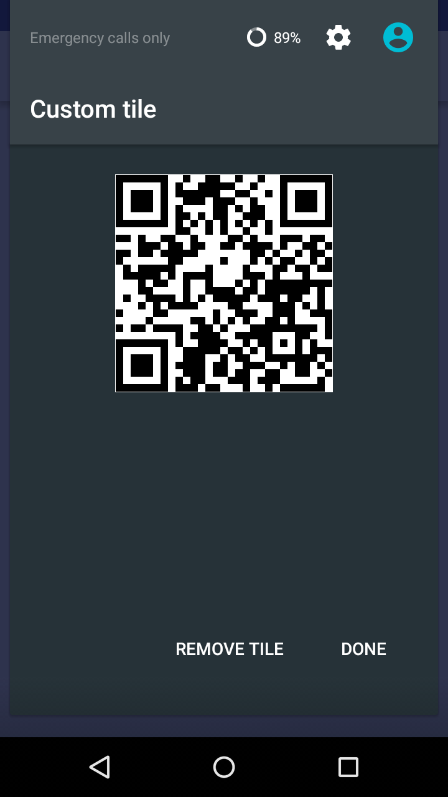
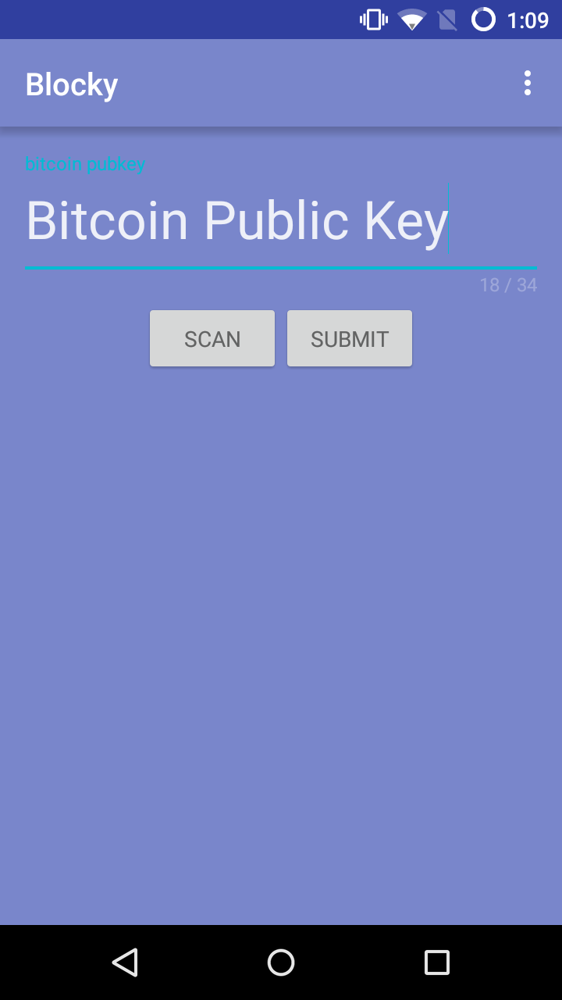

# Blocky

Blocky serves a simple purpose. It adds your Bitcoin Public Key QR code to a place it belongs, as accessible as possible. 

It adds your bitcoin wallet to your quick settings! 

Because it lives in the System UI you'll never have to wait for your bitcoin wallet to load ever again.  

## How it works 
Blocky leverages the CyanogenMod SDK in order to create a custom tile that contains your public key QR. 

It's implementation is also rather straightforward. We take the public key on the App's Launching. Once you add it you're done! 

When you put in your public key we make a network call to the Blockchain API to generate a QR image that propagates the RemoteView that you  see in the drawer. 

## Requires
- CyanogenMod 12+	
- Any Bitcoin Wallet Public Key

## Contributors 
This Hack couldn't have been possible without the awesome help with the design and functionality from my partners and the really kind help from the CyanogenMod team. 

Eric Summins

[Chenlei Shen](https://github.com/chenleishen93)

[Jen Platt](https://www.linkedin.com/pub/jennifer-platt/93/a2/5a6)

[Mina Gadalla](https://github.com/monmon-2007)

Adnan Begovic (for teaching me up until 5am)

### This hack recieved the CyanogenMod SDK prize at HackThePlanet!

